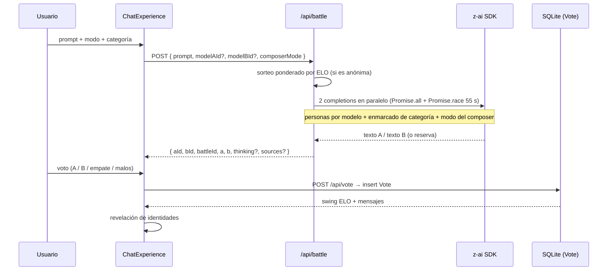
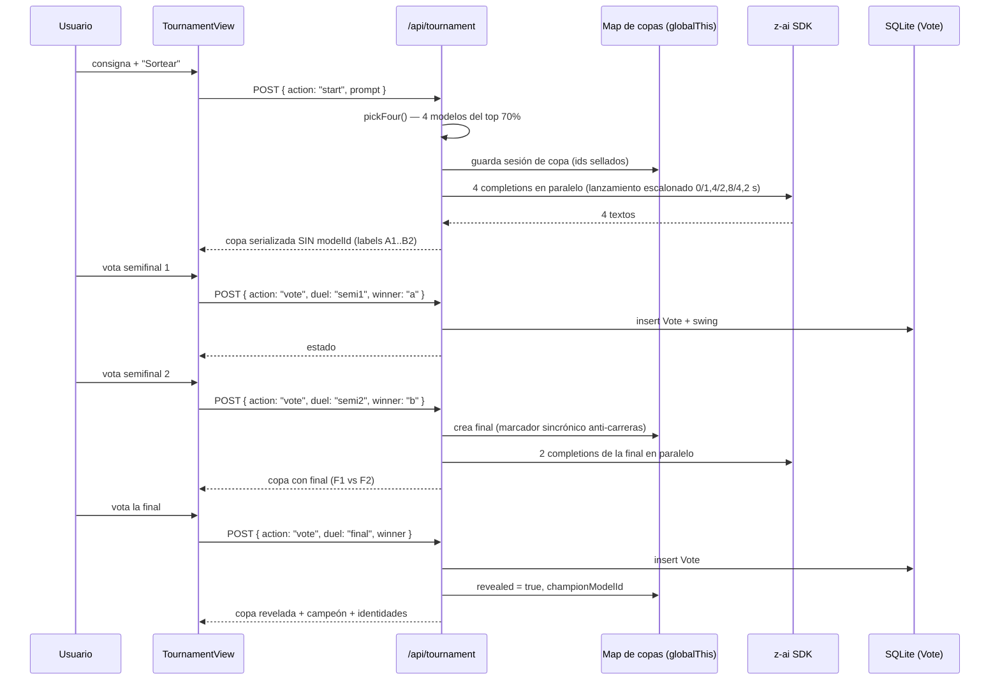

# Arquitectura de todólogo.ai

> Documento de referencia técnica: cómo está construido el proyecto, por qué está construido así y dónde están los límites conocidos.

---

## 1. Visión general

todólogo.ai es una aplicación **Next.js 16 con App Router** que combina en un único despliegue:

- **Una SPA de arena** (React 19) con los modos de juego, el ranking y las páginas de contenido.
- **Un backend HTTP** compuesto por *route handlers* (`src/app/api/**`) que encapsulan el acceso al SDK de IA y a la base de datos.
- **Una base de datos SQLite** gestionada con Prisma, única fuente de verdad del ELO, los votos, las ejecuciones del agente y las cuentas.

```
Navegador ──(fetch JSON)──► Route Handlers ──► z-ai-web-dev-sdk (IA real)
                                │
                                └──► Prisma ──► SQLite (Vote · AgentRun · User)
```

No hay estado de sesión distribuido ni cachés externas: el despliegue es un proceso Node (desarrollo o standalone) y las "sesiones" volátiles —como las copas en curso— viven en la memoria de ese proceso.

## 2. Capas y responsabilidades

| Capa | Ruta | Responsabilidad | No hace |
|---|---|---|---|
| Páginas | `src/app/**/page.tsx` | Rutas y metadatos | Lógica de negocio |
| Shell | `src/components/shell/` | Sidebar, TopBar, contexto de arena (`ArenaMode`), búsqueda ⌘K | Llamadas a la IA |
| Arena | `src/components/arena/` | `ChatExperience` (4 modos + composer), `TournamentView` (copa), `LeaderboardView`, render de Markdown, visor 3D | Persistencia de ELO |
| Dominio | `src/lib/` | Catálogo de modelos, personas, ELO, categorías, historial, ajustes, insignias, auth | Render |
| API | `src/app/api/**` | Validación de entrada, orquestación del SDK, escrituras en BD, serialización pública | Render |

**Regla de la casa:** las rutas de API nunca devuelven datos internos que el UI no deba ver (p. ej., la copa serializa sin `modelId` hasta la revelación). La privacidad del anonato es responsabilidad del *backend*, no del cliente.

## 3. Flujo de una batalla (`POST /api/battle`)



Detalles que importan:

- **Sorteo ponderado**: el pool de anónimas es el top 60% por ELO, para que las batallas sean relevantes.
- **Personas** (`src/lib/personas.ts`): cada modelo recibe un estilo distinto (consultor, narrativo, ingenioso…), de modo que el duelo compara enfoques, no dos clones de la misma plantilla.
- **Composer modes**: `codigo`, `imagen`, `video`, `modelos3d`, `web`, `profundo` cambian el *system prompt* o el pipeline (web añade resultados de búsqueda reales con citas; profundo activa `thinking`).
- **Timeout blindado**: toda llamada al SDK corre contra `Promise.race` de 55 s; si vence el temporizador, la respuesta de reserva mantiene el flujo y el voto sigue siendo válido.

## 4. Flujo de la Copa Todólogo (`POST /api/tournament`)



Invariantes de la copa:

1. **Anonato en la serialización**, no en la UI: `publicState()` elimina `modelId` mientras `revealed === false`.
2. **Idempotencia**: un duelo con `winner` ya fijado no se re-vota; la llamada devuelve el estado actual.
3. **Anti-carreras**: la final se inserta en el mapa *sincrónicamente* antes de await-ear la generación; si dos votos llegan a la vez, el segundo ve `final` presente y no duplica generación.
4. **Resiliencia**: cada contendiente tiene 1 reintento dentro del presupuesto temporal (44 s primera pasada + reintento hasta agotar 52 s); si todo falla, respuesta de reserva y la copa continúa.
5. **Limpieza**: el mapa conserva las 120 copas más recientes (expiración por estampa de tiempo).

## 5. Modelo de datos (Prisma)

```prisma
Vote      { id, battleId, modelAId, modelBId, winner: "A"|"B"|"tie"|"bad", category, createdAt }
AgentRun  { id, description, projectType, autonomy, budget, status, createdAt }
User      { id, email (unique), name, passwordHash?, provider: "email"|"google"|"github"|"microsoft"|"x", createdAt }
```

- El **ELO no se almacena por modelo**: el ELO base vive en `src/lib/models-data.ts` (catalogado) y el **delta** se recalcula desde la tabla `Vote` con cada lectura. Esto hace el ranking *auditables*: cualquier delta es trazable a votos concretos.
- `battleId` es el hilo conductor: en batallas es `btl_…` y en la copa es `copa_…:semi1|semi2|final`, lo que permite auditar un torneo entero filtrando por prefijo.

## 6. El cálculo ELO

```
expectedScore(ra, rb) = 1 / (1 + 10^((rb - ra) / 400))

delta(victorias, derrotas, empates) =
    clamp( 18·(V−D)/√(2+n) + 1,2·E , −48, +48 )

swing(duelo) = round( 24·(S − E) )        // S∈{1,0}, E = prob. esperada
```

- **delta** se calcula *desde la base de datos* (votos históricos) — atenuación por volumen: `√(2+n)` en el denominador.
- **swing** se calcula *para el duelo concreto* y es lo que muestra el toast y las tarjetas de la copa.
- **Categorías**: `categoryElo()` aplica un boost de ±14/−26 según las especialidades del modelo más un sesgo determinista por hash — estable entre lecturas, distinto por categoría.

## 7. Decisiones de diseño relevantes

| Decisión | Razón |
|---|---|
| `Promise.race` con timeout en **todas** las llamadas al SDK | Un proveedor lento no puede romper la UX; siempre hay respuesta (real o reserva) y el voto cuenta |
| Sesiones de copa en `globalThis` (no en BD) | El ciclo de vida de una copa es de minutos; persistirlas añadiría escrituras y limpieza por beneficio nulo. El ELO sí es persistente porque los votos van a BD |
| Lanzamiento escalonado (0–4,2 s) de los 4 contendientes | Evita ráfagas simultáneas que algunos proveedores rechazan; el coste total es casi nulo porque siguen corriendo en paralelo |
| Catálogo de modelos como código (`models-data.ts`) | Los metadatos (precios, contexto, licencia, ELO base) cambian poco y se versionan con PRs revisables |
| Insignias/ajustes/historial en `localStorage` | Cero backend para preferencias; la cuenta (BD) queda para lo que es multi-dispositivo |
| Interfaz siempre en español, iconos SVG (lucide), sin emojis en UI | Identidad del producto y accesibilidad; los emojis se reservan para marcas de demostración |
| Deltas de ELO derivados de votos, nunca escritos | El ranking es reproducible y auditable; corregir un voto malo es borrar una fila |

## 8. Seguridad

- Contraseñas con **scrypt** (nunca texto plano); sesión en cookie httpOnly.
- `.env*` excluido del repositorio; ninguna clave viaja al cliente.
- La serialización pública de la copa protege el anonato; los IDs solo aparecen tras la revelación.
- Entradas validadas en cada route handler (longitudes, enums, JSON) con respuestas de error tipadas.

## 9. Límites conocidos (y cómo escalarlos)

| Límite | Impacto | Camino de escalado |
|---|---|---|
| Copas en memoria de proceso | Se pierden al reiniciar; no funciona multi-instancia | Mover el mapa a una tabla `Copa` en Prisma (el cambio es localizado en `persist`/`store.get`) |
| SQLite | Un solo escritor | Postgres con el mismo esquema Prisma |
| Sin rate-limiting | Uso interno/demo | Middleware con token bucket por IP antes de `/api/*` |
| Delta ELO recalculado por lectura | Barato hoy (<10⁴ votos) | Tabla de agregados incremental cuando el volumen lo pida |
| `maxDuration = 60` en las rutas de generación | Copas de 8/16 necesitarán generación por tandas o trabajo en segundo plano + polling | Encolar semifinales y sondear estado desde el cliente |
