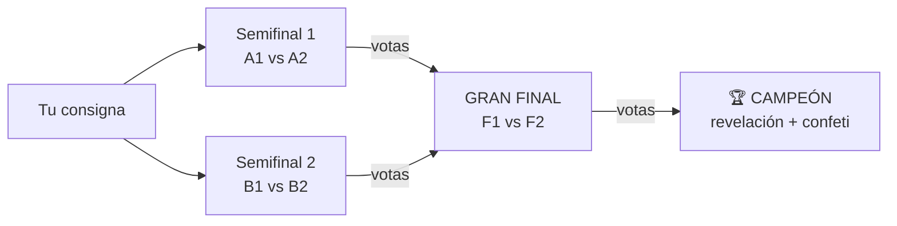
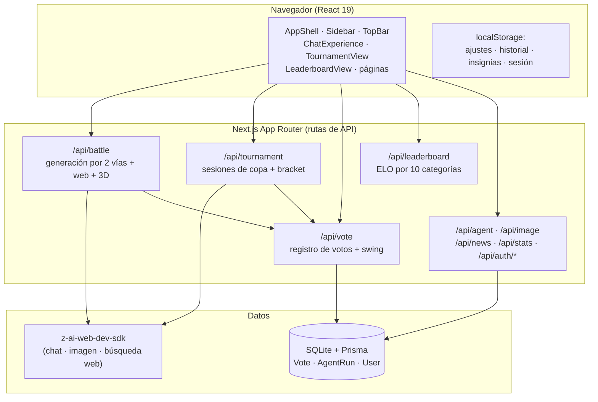

<p align="center">
  
</p>

<h1 align="center">todólogo.ai</h1>

<p align="center">
  <strong>El arena de IA en español: batallas anónimas entre modelos, torneos de eliminación directa y un ranking ELO que se mueve con cada voto real.</strong>
</p>

<p align="center">
  <a href="#-estado-del-proyecto"></a>
  <a href="LICENSE"></a>
  
  
  
  <a href="CONTRIBUTING.md"></a>
</p>

---

## Índice

1. [¿Qué es todólogo.ai?](#-qué-es-todólogoai)
2. [Por qué no es otro clon de arena.ai](#-por-qué-no-es-otro-clon-de-arenaai)
3. [Modos de la arena](#-modos-de-la-arena)
4. [La Copa Todólogo (Modo Torneo)](#-la-copa-todólogo-modo-torneo)
5. [Superpoderes del chat](#-superpoderes-del-chat)
6. [Demostraciones animadas](#-demostraciones-animadas)
7. [Inicio rápido](#-inicio-rápido)
8. [Arquitectura](#️-arquitectura)
9. [El sistema ELO](#-el-sistema-elo)
10. [Referencia de la API](#-referencia-de-la-api)
11. [Estructura del repositorio](#-estructura-del-repositorio)
12. [Roadmap y changelog](#-roadmap-y-changelog)
13. [Contribuir](#-contribuir)
14. [Seguridad](#-seguridad)
15. [Licencia](#-licencia)

---

## ¿Qué es todólogo.ai?

**todólogo.ai** es una plataforma web completa de comparación de modelos de IA construida íntegramente en español. Está inspirada en la mecánica de los *arenas* de evaluación por pares —dos modelos responden la misma pregunta y una persona juzga cuál lo hace mejor— pero la lleva varios pasos más allá: torneos de eliminación directa, diez categorías temáticas (cinco de ellas exclusivas), un sistema ELO persistente con estadísticas en vivo, y una suite de "superpoderes" en el chat que incluye generación de imágenes, modelos 3D interactivos, búsqueda web real y pensamiento profundo visible.

El proyecto nace con una obsesión: **el detalle**. La interfaz replica la calidez y sobriedad de los mejores productos editoriales —fondo crema `#FCFAF8`, tinta `#2E2B29`, acentos amarillo `#F4C406`, titulares serif y nombres de modelo en tipografía monoespaciada— pero todo el contenido, los textos, las personas de los modelos y las reglas del juego están pensados desde cero para un público hispanohablante. No es una traducción: es un arena concebido en español.

Debajo del capó hay un backend real: 56 modelos de 29 organizaciones compiten con respuestas generadas al vuelo por un SDK de IA, cada voto se escribe en una base de datos SQLite vía Prisma, y el ranking se recalcula a partir de ese historial real de victorias y derrotas. Nada es una simulación estática: si votas, el ELO se mueve; si inicias una Copa, cuatro modelos de verdad se enfrentan en paralelo.

## Por qué no es otro clon de arena.ai

| Capacidad | arena.ai (LMArena) | todólogo.ai |
|---|:---:|:---:|
| Batalla anónima 1 vs 1 | ✔ | ✔ |
| Ranking ELO por categorías | ✔ (5 categorías) | ✔ (**10 categorías**) |
| Torneo de eliminación directa | ✘ | ✔ **Copa Todólogo** |
| Matemáticas, Datos y SQL, Traducción, Educación, Negocios como categorías de voto | ✘ | ✔ **exclusivas** |
| Modo Agente con planes de misión generados por IA | ✘ | ✔ |
| Interfaz 100% en español | ✘ | ✔ |
| Chat con imagen, 3D interactivo, vídeo, web real y pensamiento profundo | ✘ | ✔ |
| Skills con `/` que configuran el chat por ti | ✘ | ✔ (14 skills) |
| Calculadora de costes por tokens y Pareto ELO/precio | ✘ | ✔ |
| 35 conectores integrados (Slack, GitHub, Notion, Stripe…) | ✘ | ✔ |
| Registro e inicio de sesión (email + social) | ✔ | ✔ |

La filosofía es simple: **todo lo que tiene arena.ai, más un puñado de cosas que no tiene nadie**. La Copa Todólogo es el ejemplo bandera —no existe ningún arena público con torneos de eliminación directa entre modelos donde el usuario juzga cada ronda— y las cinco categorías exclusivas (Matemáticas, Datos y SQL, Traducción, Educación y Negocios) abren el voto a casos de uso que los arenas clásicos ignoran.

## Modos de la arena

### ⚔️ Modo Batalla
Dos modelos elegidos por sorteo ponderado por ELO responden tu pregunta en paneles paralelos. Sus identidades permanecen anónimas hasta que votas (`A es mejor`, `B es mejor`, `Empate`, `Ambos malos`). Al votar, se destapan los nombres, se muestra el swing de ELO del duelo y tu voto queda registrado en la base de datos para siempre. Soporta historial multi-turno: puedes continuar la conversación con ambos modelos a la vez.

### 👥 Lado a Lado
Igual que la batalla, pero tú eliges los dos contendientes del catálogo (con buscador por nombre u organización). Ideal para duelos concretos: *Claude Opus 5 contra GPT-6 Astra para tu caso de uso exacto*.

### 💬 Directo
Chat clásico de un panel con el modelo que elijas, multi-turno, con todos los superpoderes del composer disponibles (imagen, 3D, web, código, skills…).

### 🤖 Modo Agente
Describe una misión (juego AAA, app fullstack, migración de datos…), elige tipo de proyecto, nivel de autonomía (L1–L3) y presupuesto, y el escuadrón de agentes genera un plan completo: equipo de agentes especializados, fases del proyecto, stack recomendado, entregables, riesgos detectados y criterios de éxito. Las ejecuciones se persisten en la base de datos.

### 🏆 Copa Todólogo (Modo Torneo)
Nuestro modo estrella — [sección dedicada abajo](#-la-copa-todólogo-modo-torneo), porque no existe en ningún otro arena.

## La Copa Todólogo (Modo Torneo)

> **Cuatro modelos. Una consigna. Dos rondas. Un solo campeón.**

Es un torneo de eliminación directa al estilo de un cuadro de tenis, pero entre modelos de lenguaje, juzgado por ti:



**Cómo funciona, paso a paso:**

1. **Sorteo.** Escribes la consigna y el servidor sortea 4 modelos distintos del tramo alto del ranking (top 70% por ELO). Sus identidades se sellan en una sesión de copa en el servidor —el cliente jamás ve los IDs, el anonato es real, no cosmético.
2. **Semifinales en paralelo.** Los 4 modelos generan su respuesta a la misma consigna simultáneamente (con lanzamientos escalonados y un reintento automático por si algún proveedor falla). Votan en dos duelos: `A1 vs A2` y `B1 vs B2`.
3. **Gran final al vuelo.** En cuanto ambas semifinales tienen ganador, los dos finalistas **vuelven a generar** respuestas nuevas (no se reciclan las de semifinales) mientras la interfaz muestra el pulso de la final. Votas al campeón.
4. **Revelación.** Con el voto de la final se destapan las cuatro identidades, el campeón recibe su corona con confeti y se muestra el mapa completo de "quién era quién".
5. **ELO real.** Cada duelo (2 semifinales + final) escribe un voto en la base de datos con la misma mecánica que el resto de la arena: el ranking global lo refleja de inmediato y cada tarjeta muestra su swing de ELO.

**Decisiones de diseño que la hacen única:**

- **Anonato verificable, no decorativo.** La serialización pública de la copa elimina los `modelId` hasta la revelación; ni inspeccionando la red se puede saber quién compite antes del final.
- **Votos idempotentes.** Votar dos veces el mismo duelo no duplica el voto ni corrompe el ELO (la segunda llamada devuelve el estado actual).
- **Anti-carreras.** La final se crea con un marcador sincrónico en el servidor antes de generar, así que dos votos casi simultáneos nunca disparan dos finales.
- **Sesiones de copa** en memoria del proceso con expiración y limpieza automática (se conservan las 120 más recientes).

## Superpoderes del chat

El composer (disponible en Batalla, Lado a Lado y Directo) incluye:

| Superpoder | Qué hace |
|---|---|
| 📎 **Adjuntos reales** | Arrastra archivos o pega enlaces (PDF, Word, Excel, vídeo, texto); el contenido legible viaja al modelo con tu mensaje |
| ⌨️ **`/` Skills** | 14 habilidades (`/web`, `/profundo`, `/imagen`, `/video`, `/codigo`, `/resume`, `/traduce`, `/sql`…) que configuran el modo del chat por ti |
| 🎨 **Modo imagen** | Generación real de ilustraciones por IA a partir de tu descripción, con descarga directa |
| 🧊 **Modelos 3D** | 133 modelos listos para girar y acercar (WebGL), creación de modelos a medida por IA con una "receta" de primitivas, y subida de tus propios `.glb`/`.gltf` |
| 🌐 **Búsqueda web real** | El modelo consulta internet en tiempo real, responde con datos frescos y cita fuentes con enlaces |
| 🧠 **Pensamiento profundo** | El modelo razona paso a paso antes de responder y muestra su razonamiento visible en un blockquote |
| 💻 **Modo código** | Respuestas con bloques completos, lenguaje identificado y botón de copiar en cada bloque |
| 🎬 **Modo vídeo (beta)** | El modelo convierte tu idea en un guion de vídeo con escenas, planos, música y transiciones |

Además: autoguardado del historial en `Recientes` (con restauración completa del modo y la batalla), insignias **¡NUEVO!** que desaparecen cuando usas la función, 15 ajustes persistentes (tema, densidad, fuente, categoría predeterminada, confirmación de voto, autoguardado, sonido, animaciones reducidas…), página de conectores con 35 integraciones, login/registro con email cifrado (scrypt) o entrada social, calculadora de costes con comparador de eficiencia y canal de novedades.

## Demostraciones animadas

Todas las demos son **SVG animados** (CSS dentro de SVG, sin JavaScript ni GIFs): ligeras, nítidas a cualquier zoom y renderizadas nativamente por GitHub.

### La Copa Todólogo — el torneo que no existe en ningún otro arena
<p align="center"></p>

### Batalla anónima con voto y swing de ELO
<p align="center"></p>

### Ranking ELO en vivo
<p align="center"></p>

## Inicio rápido

**Requisitos:** Node.js 20+ (o Bun), y una instancia con acceso al SDK `z-ai-web-dev-sdk` (en este entorno ya viene preconfigurado).

```bash
# 1. Clona el repositorio
git clone https://github.com/FazeUrru/TODO-LOGO-AI.git
cd TODO-LOGO-AI

# 2. Instala dependencias
npm install        # o: bun install

# 3. Configura el entorno
cp .env.example .env   # define DATABASE_URL="file:./db/custom.db"

# 4. Crea el esquema de la base de datos
npm run db:push

# 5. Arranca en desarrollo
npm run dev        # http://localhost:3000
```

| Script | Qué hace |
|---|---|
| `npm run dev` | Servidor de desarrollo en el puerto 3000 |
| `npm run build` | Compilación de producción (standalone) |
| `npm start` | Sirve la compilación de producción |
| `npm run lint` | ESLint sobre todo el proyecto |
| `npm run db:push` | Aplica el esquema Prisma a SQLite |
| `npm run db:generate` | Regenera el cliente Prisma |

> **Nota:** la primera vez que visites cada página en desarrollo, Next.js la compila bajo demanda; la primera generación de una Copa tarda entre 6 y 50 s según la latencia de los proveedores.

## ⚙️ Arquitectura

Resumen ejecutivo — el análisis completo, con diagramas de secuencia y decisiones de diseño, está en [`ARCHITECTURE.md`](ARCHITECTURE.md).



Pilares técnicos:

- **Timeout blindado** en toda llamada al SDK: `Promise.race` con límite de 55 s y respuesta de reserva que nunca rompe la experiencia.
- **Personas por modelo** (`src/lib/personas.ts`): cada familia de modelos tiene un estilo de respuesta propio para que los duelos comparen estilos reales.
- **ELO derivado de votos** (`src/lib/elo.ts`): el delta no se guarda por modelo; se recalcula desde el historial de votos con atenuación por número de partidas (`18·(V−D)/√(2+n)`).
- **Estado del cliente** en React puro + contexto (sin stores externos), con persistencia selectiva en `localStorage`.

## El sistema ELO

Cada modelo tiene un ELO base (1500 ± variación) y **deltas derivados de votos reales**:

```
delta = clamp( 18 · (victorias − derrotas) / √(2 + partidas) + 1,2 · empates,  −48, +48 )
```

- **Atenuación por volumen**: cuantos más duelos juega un modelo, menos mueve cada voto individual — el ranking se estabiliza solo.
- **Swing del duelo**: al votar se calcula `24 · (S − E)`, donde `S` es el resultado (1/0) y `E` la probabilidad esperada por ELO clásico; vencer al favorito paga más.
- **10 categorías**: cada categoría aplica un *boost* a los modelos cuyas especialidades encajan (`codigo`, `razonamiento`, `texto`, `agente`…) más un sesgo determinista por hash, de modo que el top de Código no tiene por qué coincidir con el de Traducción.
- **Copa Todólogo**: cada duelo del torneo escribe votos con la misma mecánica — ganar la copa no da bonus artificiales, da ELO real.

## Referencia de la API

Resumen rápido — la referencia completa con cuerpos de petición, respuestas de ejemplo y códigos de error está en [`docs/API.md`](docs/API.md).

| Endpoint | Método | Descripción |
|---|---|---|
| `/api/battle` | `POST` | Genera respuestas (batalla anónima, lado a lado, directo) con web, 3D y pensamiento profundo |
| `/api/tournament` | `POST` | `start` (sortea y genera semifinales) y `vote` (registra voto, dispara la final, revela el campeón) |
| `/api/vote` | `POST` | Registra un voto de batalla y devuelve el swing ELO |
| `/api/leaderboard` | `GET` | Ranking por categoría con deltas en vivo, IC95 y votos |
| `/api/agent` | `POST` | Plan de misión del Modo Agente (persistido) |
| `/api/image` | `POST` | Generación de imágenes |
| `/api/news` | `GET` | Feed de novedades con caché de respaldo |
| `/api/stats` | `GET` | Métricas agregadas del arena |
| `/api/auth/*` | `POST` | `login`, `register`, `logout`, `social`, `me` |

## Estructura del repositorio

```text
TODO-LOGO-AI/
├── src/
│   ├── app/
│   │   ├── page.tsx              # Portada de la arena
│   │   ├── leaderboard/          # Ranking ELO (10 categorías, Pareto, Labs)
│   │   ├── novedades/  empresas/  calculadora/  conectores/
│   │   ├── iniciar-sesion/  registro/  ajustes/  acerca/  changelog/
│   │   └── api/                  # battle · tournament · vote · leaderboard · agent · image · news · stats · auth/*
│   ├── components/
│   │   ├── arena/                # ChatExperience · TournamentView · LeaderboardView · Markdown · Viewer3D · ProviderLogo
│   │   ├── shell/                # AppShell · Sidebar · TopBar · SearchDialog · arena-context
│   │   └── auth/                 # SocialAuth
│   └── lib/
│       ├── models-data.ts        # Catálogo: 56 modelos, 29 organizaciones
│       ├── personas.ts           # Estilos de respuesta por modelo
│       ├── elo.ts                # Categorías, expectedScore, deltas
│       ├── history.ts            # Autoguardado en localStorage
│       ├── badges.tsx            # Insignias ¡NUEVO! (useSyncExternalStore)
│       └── settings.tsx          # 15 ajustes persistentes
├── prisma/schema.prisma          # Vote · AgentRun · User
├── docs/
│   ├── API.md                    # Referencia completa de la API
│   └── demos/*.svg               # Demostraciones animadas (CSS-SVG)
├── public/providers/             # Logotipos oficiales de las 29 organizaciones
└── ARCHITECTURE.md  ROADMAP.md  CHANGELOG.md  CONTRIBUTING.md
```

## Roadmap y changelog

- 🗺️ [`ROADMAP.md`](ROADMAP.md) — hacia dónde va el proyecto: torneos de 8 y 16, OAuth nativo, perfiles con historial en la nube, arena de imágenes, API pública…
- 📋 [`CHANGELOG.md`](CHANGELOG.md) — cada versión con sus NUEVO/MEJORA/CORRECCIÓN, presente y futuro.

## Contribuir

Las contribuciones son bienvenidas. Lee [`CONTRIBUTING.md`](CONTRIBUTING.md) para el entorno de desarrollo, las convenciones (commits, estilo, reglas de la casa como "interfaz siempre en español" y "iconos SVG, no emojis") y las recetas rápidas: añadir un modelo, una categoría o un endpoint.

## Seguridad

- Las contraseñas se almacenan cifradas con `scrypt` (nunca en texto plano) y la sesión se firma en una cookie httpOnly.
- Nunca commits secretos: `.env*` está en `.gitignore`. Si un token llega a filtrarse en una conversación o issue, **rodarlo inmediatamente** (regenerar y revocar el anterior).
- Las sesiones de copa viven en memoria del proceso con limpieza automática; no contienen datos personales.

## Licencia

[MIT](LICENSE) © 2026 todólogo.ai
