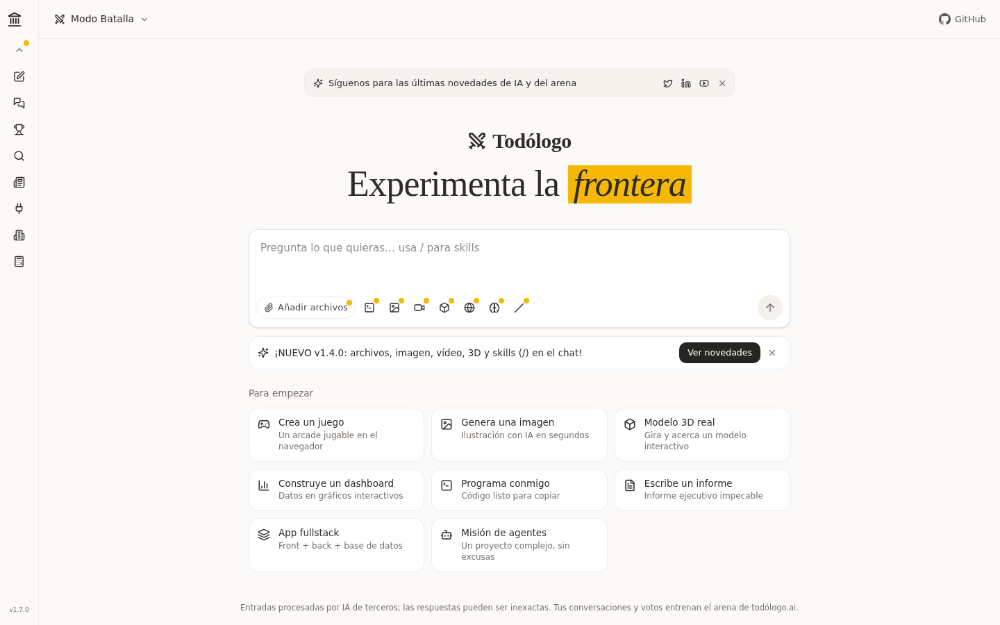
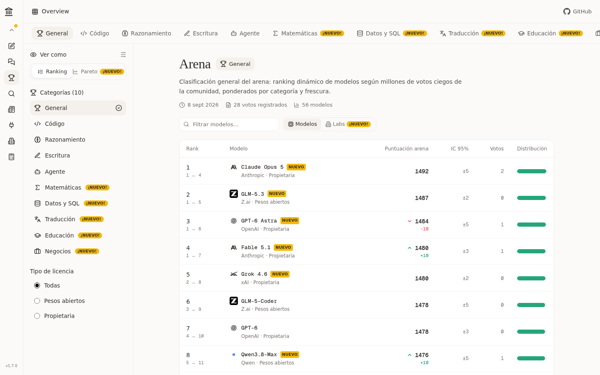
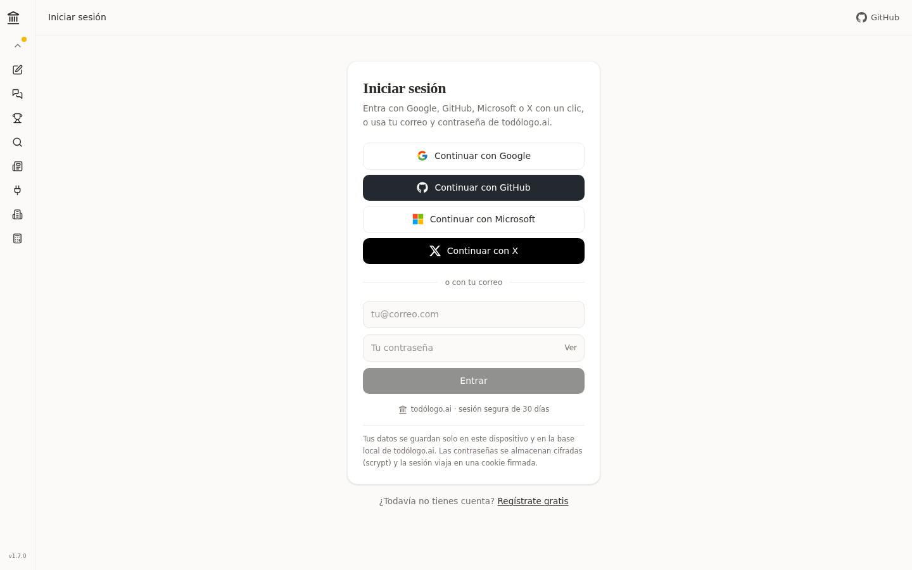
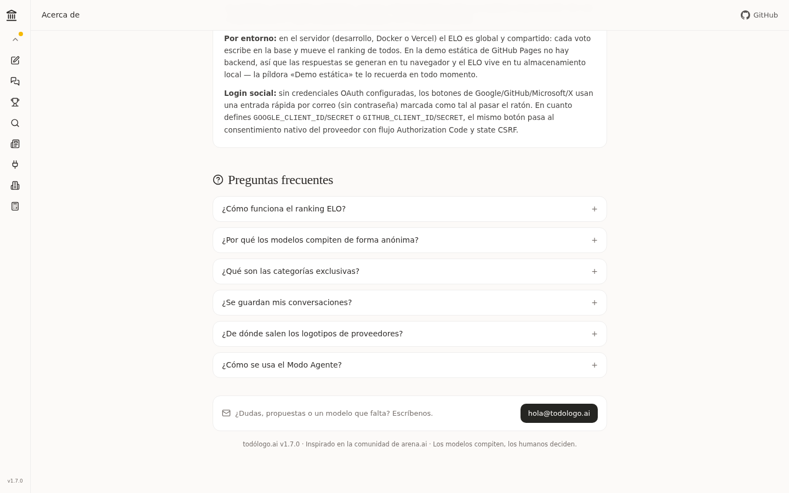
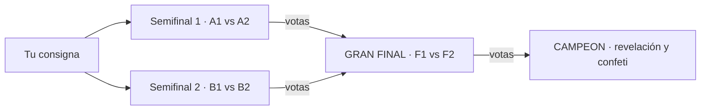
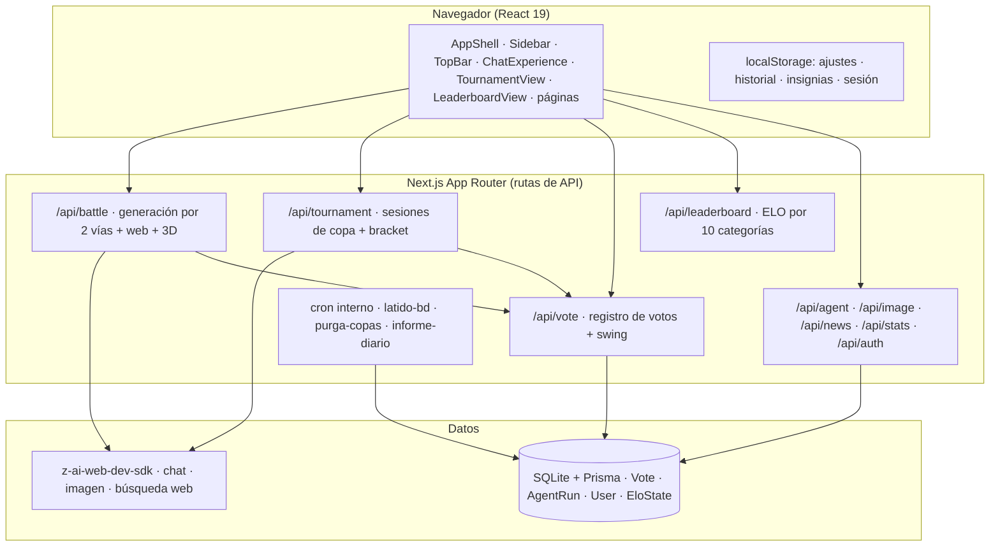

<p align="center">
  
</p>

<h1 align="center">todólogo.ai</h1>

<p align="center">
  <strong>El arena de IA en español: batallas anónimas entre modelos, torneos de eliminación directa y un ranking ELO que se mueve con cada voto real.</strong>
</p>

<p align="center">
  <a href="#-resumen-en-30-segundos"></a>
  <a href="LICENSE"></a>
  <a href="https://github.com/FazeUrru/TODO-LOGO-AI/actions/workflows/ci.yml"></a>
  <a href="https://codecov.io/gh/FazeUrru/TODO-LOGO-AI"></a>
  <a href="https://todo-logo-ai.vercel.app/"></a>
  <a href="https://github.com/FazeUrru/TODO-LOGO-AI/actions/workflows/deploy-pages.yml"></a>
  
  
  
  
  <a href="CONTRIBUTING.md"></a>
</p>

<p align="center">
  ▶️ <strong><a href="https://todo-logo-ai.vercel.app/">ABRIR LA ARENA EN PRODUCCIÓN — https://todo-logo-ai.vercel.app/</a></strong> ▶️<br>
  <sub>IA real, base de datos y torneos globales, sin instalar nada · 🌐 demo estática: <a href="https://fazeurru.github.io/TODO-LOGO-AI/">fazeurru.github.io/TODO-LOGO-AI</a></sub>
</p>

---

## ⚡ Resumen en 30 segundos

| | |
|---|---|
| 🐳 **En 1 clic** | `docker compose up --build` — backend real con IA, base de datos y ELO persistente en un solo comando ([guía Docker](#-docker)) |
| 🥊 **Qué es** | Arena de IA en español: batallas anónimas, Copa de eliminación directa (4/8/16 modelos) y ranking ELO que se mueve con cada voto real |
| ⚡ **Cómo responde** | Streaming SSE: el texto aparece palabra a palabra, también el razonamiento profundo — sin spinners eternos |
| 🤖 **Con qué** | 56 modelos de 28 organizaciones · respuestas generadas al vuelo · backend real (Next.js 16 + Prisma + SQLite) |
| 🎮 **Extras únicos** | Arcade con 3 juegos autoevolutivos (GTA VI Costa Vice, Isla Maldita, Imperios RTS) · Modo Agente · imágenes, 3D, web y pensamiento profundo en el chat |
| 🛡️ **Calidad** | 87 tests · 92,3 % de cobertura (líneas) en la lógica central · CI en vivo ([Tests y CI](#-tests-y-ci)) |
| ⚙️ **Operación** | Cron interno con informe de salud en [`/api/health`](#-referencia-de-la-api) + watchdog con reinicio automático ([sección Operar](#%EF%B8%8F-operar-watchdog-y-cron-nivel-empresarial)) |
| 🔒 **Honestidad** | Las «56 voces» salen de un motor propio con 56 personalidades — [qué es real y qué no](#-honestidad-qué-es-real-y-qué-no) |

> ⚠️ **Descargo sobre la demo de GitHub Pages** — la demo juega **en tu navegador** (sin servidor): respuestas, votos y ELO se generan y guardan en tu `localStorage` con las mismas fórmulas. **No significa que el proyecto sea una simulación**: el mismo código, sin cambios, arranca un **backend real con IA, base de datos Prisma/SQLite y OAuth** (local, Docker o Vercel — [cómo](#-inicio-rápido)). ¿Sin instalar nada? Abre la [instancia oficial en producción →](https://todo-logo-ai.vercel.app/). La app lo declara **en grande**: un banner ámbar en la parte superior con el comando Docker a un clic, además de la píldora «Demo estática». Detalles: [tabla de honestidad](#-honestidad-qué-es-real-y-qué-no).

## Índice

1. [Resumen en 30 segundos](#-resumen-en-30-segundos)
2. [¿Qué es todólogo.ai?](#-qué-es-todólogoai)
3. [Demo en vivo (GitHub Pages)](#-demo-en-vivo-github-pages)
4. [Capturas de pantalla](#-capturas-de-pantalla)
5. [Por qué no es otro clon de arena.ai](#-por-qué-no-es-otro-clon-de-arenaai)
6. [Modos de la arena](#-modos-de-la-arena)
7. [La Copa Todólogo (Modo Torneo)](#-la-copa-todólogo-modo-torneo)
8. [Superpoderes del chat](#-superpoderes-del-chat)
9. [StreamDog: cine y series gratis, contenido infinito](#-streamdog-cine-y-series-gratis-contenido-infinito)
10. [Demostraciones animadas](#-demostraciones-animadas)
11. [Honestidad: qué es real y qué no](#-honestidad-qué-es-real-y-qué-no)
12. [Inicio rápido](#-inicio-rápido)
13. [Tests y CI](#-tests-y-ci)
14. [Docker](#-docker)
15. [Despliegue en Vercel](#-despliegue-en-vercel)
16. [Operar: watchdog y cron (nivel empresarial)](#%EF%B8%8F-operar-watchdog-y-cron-nivel-empresarial)
17. [OAuth nativo (Google / GitHub)](#-oauth-nativo-google--github)
18. [Arquitectura](#%EF%B8%8F-arquitectura)
19. [El sistema ELO](#-el-sistema-elo)
20. [Referencia de la API](#-referencia-de-la-api)
21. [Estructura del repositorio](#-estructura-del-repositorio)
22. [Roadmap y changelog](#-roadmap-y-changelog)
23. [Contribuir](#-contribuir)
24. [Seguridad](#-seguridad)
25. [Licencia](#-licencia)

---

## ¿Qué es todólogo.ai?

**todólogo.ai** es una plataforma web completa de comparación de modelos de IA construida íntegramente en español. Está inspirada en la mecánica de los *arenas* de evaluación por pares —dos modelos responden la misma pregunta y una persona juzga cuál lo hace mejor— pero la lleva varios pasos más allá: torneos de eliminación directa, diez categorías temáticas (cinco de ellas exclusivas), un sistema ELO persistente con estadísticas en vivo, y una suite de "superpoderes" en el chat que incluye generación de imágenes, modelos 3D interactivos, búsqueda web real y pensamiento profundo visible.

El proyecto nace con una obsesión: **el detalle**. La interfaz replica la calidez y sobriedad de los mejores productos editoriales —fondo crema `#FCFAF8`, tinta `#2E2B29`, acentos amarillo `#F4C406`, titulares serif y nombres de modelo en tipografía monoespaciada— pero todo el contenido, los textos, las personas de los modelos y las reglas del juego están pensados desde cero para un público hispanohablante. No es una traducción: es un arena concebido en español.

Debajo del capó hay un backend real: 56 modelos de 28 organizaciones compiten con respuestas generadas al vuelo por un SDK de IA, cada voto se escribe en una base de datos SQLite vía Prisma, y el ranking se recalcula a partir de ese historial real de victorias y derrotas. Nada es una simulación estática: si votas, el ELO se mueve; si inicias una Copa, cuatro modelos de verdad se enfrentan en paralelo.

## 🌐 Demo en vivo (GitHub Pages)

**Primero, la experiencia completa: la instancia oficial corre en producción con IA real, base de datos y torneos globales — sin instalar nada:**

> ### → [**https://todo-logo-ai.vercel.app/**](https://todo-logo-ai.vercel.app/)

**Y además, cada push a `main` despliega automáticamente una demo funcional de la app en GitHub Pages:**

> ### → [**https://fazeurru.github.io/TODO-LOGO-AI/**](https://fazeurru.github.io/TODO-LOGO-AI/)

La demo es la aplicación completa —batallas, Copa Todólogo, ranking, modos de imagen/3D/vídeo/web, cuentas— funcionando íntegramente en tu navegador gracias a un **motor demo local** (`src/lib/demo-engine.ts`): como GitHub Pages es un hosting estático sin backend, un interceptor de `fetch` resuelve las llamadas `/api/*` en el cliente, genera las respuestas con las personas de estilo de cada modelo y guarda los votos y el ELO en tu `localStorage`. La app lo indica con una píldora discreta «Demo estática»; una pequeña honradez que además demuestra la arquitectura: la misma base de código sirve **backend real con IA** (local/Vercel/Docker) **o** demo 100 % estática sin tocar los componentes.

| | Servidor real (local / preview / Vercel) | Demo GitHub Pages |
|---|---|---|
| Respuestas | IA real vía SDK | Motor local con personas de estilo |
| Votos y ELO | SQLite + Prisma (persistentes y globales) | `localStorage` (persistentes en tu navegador) |
| Imágenes | Generación real por IA | Arte procedural SVG determinista |
| Cuentas | scrypt + sesiones en servidor | SHA-256 + sesión en `localStorage` |
| URL | [todo-logo-ai.vercel.app](https://todo-logo-ai.vercel.app/) (oficial) o la que configures | `https://fazeurru.github.io/TODO-LOGO-AI/` |

**Regenerar la demo a mano:** `node scripts/build-pages.mjs` produce el export en `.next-static/`; el workflow `.github/workflows/deploy-pages.yml` lo hace solo en cada push a `main`.

**¿Dominio propio (`todologo.ai`)?** GitHub Pages permite servir esta misma demo desde tu dominio:

1. Compra `todologo.ai` en tu registrador favorito.
2. Crea un archivo `CNAME` (raíz del export) con el texto `todologo.ai` o configura el dominio en *Settings → Pages → Custom domain*.
3. En tu DNS: registro `A` con `185.199.108.153`, `185.199.109.153`, `185.199.110.153`, `185.199.111.153` (o `CNAME` en `www` → `fazeurru.github.io`).
4. Marca *Enforce HTTPS*. Desde ese momento `https://todologo.ai` abrirá la app directamente; la URL de `github.io` seguirá funcionando como alias.

## 📸 Capturas de pantalla

Todas reales, tomadas de la aplicación en producción:

| Portada (Modo Batalla) | Ranking ELO |
|---|---|
|  |  |

| Inicio de sesión (4 vías) | Transparencia radical (/acerca) |
|---|---|
|  |  |

Hay más demos animadas (CSS-SVG, sin GIFs) en la sección [Demostraciones animadas](#-demostraciones-animadas).

## Por qué no es otro clon de arena.ai

| Capacidad | arena.ai (LMArena) | todólogo.ai |
|---|:---:|:---:|
| Batalla anónima 1 vs 1 | ✔ | ✔ |
| Ranking ELO por categorías | ✔ (5 categorías) | ✔ (**10 categorías**) |
| Torneo de eliminación directa | ✘ | ✔ **Copa Todólogo** |
| Matemáticas, Datos y SQL, Traducción, Educación, Negocios como categorías de voto | ✘ | ✔ **exclusivas** |
| Modo Agente con planes de misión generados por IA | ✘ | ✔ |
| Interfaz 100% en español | ✘ | ✔ |
| Chat con imagen, 3D interactivo, vídeo, web real y pensamiento profundo | ✘ | ✔ |
| Skills con `/` que configuran el chat por ti | ✘ | ✔ (14 skills) |
| Calculadora de costes por tokens y Pareto ELO/precio | ✘ | ✔ |
| 35 conectores integrados (Slack, GitHub, Notion, Stripe…) | ✘ | ✔ |
| Registro e inicio de sesión (email + social) | ✔ | ✔ |

La filosofía es simple: **todo lo que tiene arena.ai, más un puñado de cosas que no tiene nadie**. La Copa Todólogo es el ejemplo bandera —no existe ningún arena público con torneos de eliminación directa entre modelos donde el usuario juzga cada ronda— y las cinco categorías exclusivas (Matemáticas, Datos y SQL, Traducción, Educación y Negocios) abren el voto a casos de uso que los arenas clásicos ignoran.

## Modos de la arena

### ⚔️ Modo Batalla
Dos modelos elegidos por sorteo ponderado por ELO responden tu pregunta en paneles paralelos. Sus identidades permanecen anónimas hasta que votas (`A es mejor`, `B es mejor`, `Empate`, `Ambos malos`). Al votar, se destapan los nombres, se muestra el swing de ELO del duelo y tu voto queda registrado en la base de datos para siempre. Soporta historial multi-turno: puedes continuar la conversación con ambos modelos a la vez.

### 👥 Lado a Lado
Igual que la batalla, pero tú eliges los dos contendientes del catálogo (con buscador por nombre u organización). Ideal para duelos concretos: *Claude Opus 5 contra GPT-6 Astra para tu caso de uso exacto*.

### 💬 Directo
Chat clásico de un panel con el modelo que elijas, multi-turno, con todos los superpoderes del composer disponibles (imagen, 3D, web, código, skills…).

### 🤖 Modo Agente
Describe una misión (juego AAA, app fullstack, migración de datos…), elige tipo de proyecto, nivel de autonomía (L1–L3) y presupuesto, y el escuadrón de agentes genera un plan completo: equipo de agentes especializados, fases del proyecto, stack recomendado, entregables, riesgos detectados y criterios de éxito. Las ejecuciones se persisten en la base de datos.

### 🏆 Copa Todólogo (Modo Torneo)
Nuestro modo estrella — [sección dedicada abajo](#-la-copa-todólogo-modo-torneo), porque no existe en ningún otro arena.

## La Copa Todólogo (Modo Torneo)

> **Cuatro modelos. Una consigna. Dos rondas. Un solo campeón.**

Es un torneo de eliminación directa al estilo de un cuadro de tenis, pero entre modelos de lenguaje, juzgado por ti:



**Cómo funciona, paso a paso:**

1. **Sorteo.** Escribes la consigna y el servidor sortea 4 modelos distintos del tramo alto del ranking (top 70% por ELO). Sus identidades se sellan en una sesión de copa en el servidor —el cliente jamás ve los IDs, el anonato es real, no cosmético.
2. **Semifinales en paralelo.** Los 4 modelos generan su respuesta a la misma consigna simultáneamente (con lanzamientos escalonados y un reintento automático por si algún proveedor falla). Votan en dos duelos: `A1 vs A2` y `B1 vs B2`.
3. **Gran final al vuelo.** En cuanto ambas semifinales tienen ganador, los dos finalistas **vuelven a generar** respuestas nuevas (no se reciclan las de semifinales) mientras la interfaz muestra el pulso de la final. Votas al campeón.
4. **Revelación.** Con el voto de la final se destapan las cuatro identidades, el campeón recibe su corona con confeti y se muestra el mapa completo de "quién era quién".
5. **ELO real.** Cada duelo (2 semifinales + final) escribe un voto en la base de datos con la misma mecánica que el resto de la arena: el ranking global lo refleja de inmediato y cada tarjeta muestra su swing de ELO.

**Decisiones de diseño que la hacen única:**

- **Anonato verificable, no decorativo.** La serialización pública de la copa elimina los `modelId` hasta la revelación; ni inspeccionando la red se puede saber quién compite antes del final.
- **Votos idempotentes.** Votar dos veces el mismo duelo no duplica el voto ni corrompe el ELO (la segunda llamada devuelve el estado actual).
- **Anti-carreras.** La final se crea con un marcador sincrónico en el servidor antes de generar, así que dos votos casi simultáneos nunca disparan dos finales.
- **Sesiones de copa persistidas (v1.13.0)**: write-through en memoria + BD (tabla `CopaSesion`) — las copas sobreviven reinicios y despliegues; la memoria conserva las 160 más recientes y el cron purga la BD a los 7 días.
- **Salón de la Fama (v1.12.0)**: cada campeón coronado queda registrado en la base de datos (o en tu navegador en la demo) y aparece en la tarjeta del Modo Torneo. Desde la v1.13.0 tiene **página pública** (`/salon-de-la-fama`) con estadísticas: modelo más coronado, copa más grande y copas XL.

## Superpoderes del chat

El composer (disponible en Batalla, Lado a Lado y Directo) incluye:

| Superpoder | Qué hace |
|---|---|
| ⚡ **Streaming en vivo (SSE)** | Las respuestas se generan **palabra a palabra** con cursor parpadeante — en batalla, lado a lado y directo; el razonamiento profundo también fluye en tiempo real |
| 📎 **Adjuntos reales** | Arrastra archivos o pega enlaces (PDF, Word, Excel, vídeo, texto); el contenido legible viaja al modelo con tu mensaje |
| ⌨️ **`/` Skills** | 14 habilidades (`/web`, `/profundo`, `/imagen`, `/video`, `/codigo`, `/resume`, `/traduce`, `/sql`…) que configuran el modo del chat por ti |
| 🎨 **Modo imagen** | Generación real de ilustraciones por IA a partir de tu descripción, con descarga directa |
| 🧊 **Modelos 3D** | 133 modelos listos para girar y acercar (WebGL), creación de modelos a medida por IA con una "receta" de primitivas, y subida de tus propios `.glb`/`.gltf` |
| 🌐 **Búsqueda web real** | El modelo consulta internet en tiempo real, responde con datos frescos y cita fuentes con enlaces |
| 🧠 **Pensamiento profundo** | El modelo razona paso a paso antes de responder y muestra su razonamiento visible en un blockquote |
| 💻 **Modo código** | Respuestas con bloques completos, lenguaje identificado y botón de copiar en cada bloque |
| 🎬 **Modo vídeo (beta)** | El modelo convierte tu idea en un guion de vídeo con escenas, planos, música y transiciones |

Además: autoguardado del historial en `Recientes` (con restauración completa del modo y la batalla), insignias **¡NUEVO!** que desaparecen cuando usas la función, **30 ajustes persistentes en 9 categorías** (15 de perfil — identidad, presencia, privacidad y notificaciones — y 15 de la aplicación, todos con autoguardado y sincronización con la cuenta), página de conectores con 35 integraciones, login/registro con email cifrado (scrypt) o entrada social, calculadora de costes con comparador de eficiencia y canal de novedades.

## 🎬 StreamDog: cine y series gratis, contenido infinito

StreamDog es el estudio de entretenimiento del proyecto. Su módulo **Cine y series** (`/streamdog`) es un catálogo **REAL, legal y sin claves API** sobre fuentes públicas — cero piratería:

| Fuente | Qué aporta |
|---|---|
| **Wikimedia Commons** | Películas de dominio público **reproducibles** (.webm/.mp4 directos): Nosferatu, Night of the Living Dead, Charade, The General… |
| **Internet Archive** | Contenido infinito ♾️: éxitos eternos («Los títulos más famosos», 30 clásicos por nombre exacto) + colecciones de **film noir**, **ciencia ficción y terror**, **dibujos animados clásicos**, **televisión clásica** y **documentales** |
| **TVMaze** | Series del momento, la fila **«Lo mejor de Disney+»** y los **TOPS de plataformas** (v1.36.0): Netflix famosas, **HBO Max top 50**, Prime Video, Apple TV+, Filmin y tops temáticos (animación, basadas en hechos reales, lo más reciente) — todo como **fichas legales** con temporadas, episodios y «Ver en el origen», con el orden de la lista como ranking |

Lo que incluye el módulo:

- **UI premium/VIP**: héroe destacado con Ken Burns, buscador verde con destello, chips degradados de salto rápido, filas en carrusel con **entrada escalonada**, tarjetas que se elevan, sports VS con **cuenta atrás real** y hoja de ruta «Muy pronto» con diálogo motivador — **8 animaciones originales `sdc-*`** en GPU con `prefers-reduced-motion`.
- **Fusión elegible con el Arena** 🔗: conmutador premium entre modo **fusionado** (insignia «Ir al Arena», identidad compartida) y modo **independiente** (enlaces cruzados apagados, app autónoma para su dominio propio), persistente y a prueba de storage corrupto.
- **«Pacto abierto»** 🤝: aviso de seguridad, privacidad y legibilidad — una carta abierta y duradera a Netflix, Prime Video, Disney+, HBO Max, Apple TV y Filmin: colaboración y un acuerdo mayor, no enemistad permanente. Sin nada personal: el problema son los precios desorbitados.
- **Reproductor completo**: segundo plano real (MediaSession + Picture-in-Picture automático), reanudar donde lo dejaste, velocidades, atajos de teclado.
- **Cron empresarial cada hora** (`0 * * * *`): el backend pre-cocina todas las cachés y publica un **informe de salud** (`/api/streamdog/cron/estado`) con historial de 24 h. En Vercel vía `vercel.json` o gratis con el workflow de GitHub Actions.
- **Multilenguaje es/en/de/fr** propio del módulo, PWA instalable con service worker que **audita y repara su caché solo**, y Mi lista + Seguir viendo con autoreparación real del storage.
- **Despliegue**: guía completa en [`docs/DESPLIEGUE-VERCEL.md`](docs/DESPLIEGUE-VERCEL.md) — dashboard/CLI, **dominio propio** paso a paso y `CRON_SECRET`.

## Demostraciones animadas

Todas las demos son **SVG animados** (CSS dentro de SVG, sin JavaScript ni GIFs): ligeras, nítidas a cualquier zoom y renderizadas nativamente por GitHub.

### La Copa Todólogo — el torneo que no existe en ningún otro arena
<p align="center"></p>

### Batalla anónima con voto y swing de ELO
<p align="center"></p>

### Ranking ELO en vivo
<p align="center"></p>

## 🤝 Honestidad: qué es real y qué no

Este proyecto se toma en serio la transparencia — hay una sección equivalente dentro de la app ([`/acerca` — ábrela en la demo](https://fazeurru.github.io/TODO-LOGO-AI/acerca)), y cada revelación de batalla lo recuerda:

| Pieza | Estado real | Detalle |
|---|---|---|
| Infraestructura | ✅ **Real** | APIs propias, Prisma + SQLite, fórmulas ELO en servidor, votación idempotente por `battleId`, Copa con anonato verificado en servidor, cuentas scrypt + cookie httpOnly firmada |
| Las «56 voces» | ⚠️ **Un motor con 56 personalidades** (o voces reales con tu clave) | Todas las respuestas salen del motor único de Todólogo (GLM vía `z-ai-web-dev-sdk`) encarnando el estilo de cada modelo — no son los modelos comerciales originales, porque cada proveedor exige sus propias claves de API. **Desde la v1.12.0**, si configuras `OPENAI_API_KEY`, `ANTHROPIC_API_KEY`, `GOOGLE_AI_API_KEY` u otras, esos contendientes responden vía la API real de su proveedor y la respuesta declara qué voz se usó. Lo declaramos en la revelación y en `/acerca` |
| Login social | ⚠️ **Dos vías** | Sin credenciales OAuth: entrada rápida por correo (sin contraseña, marcada como tal). Con `GOOGLE_CLIENT_ID`/`SECRET` o `GITHUB_CLIENT_ID`/`SECRET`: flujo OAuth 2.0 nativo (Authorization Code + state CSRF) contra el consentimiento real del proveedor — [guía de OAuth](#-oauth-nativo-google--github) |
| ELO de la demo Pages | ⚠️ **Local** | En GitHub Pages no hay backend: las respuestas se generan en tu navegador y el ELO vive en tu `localStorage` (la píldora «Demo estática» lo recuerda — [descargo arriba](#-resumen-en-30-segundos)). En servidor real (local/Docker/Vercel) el ELO sí es **global**: cada voto escribe en la base compartida |
| Imágenes / 3D / vídeo | ✅ Real en servidor / ⚠️ procedural en demo | Generación por IA con backend; arte SVG procedural determinista en la demo estática |

Esta tabla existe porque preferimos los elogios por lo que funciona a los malentendidos por lo que no. ¿Quieres voces de proveedores reales? Añade las claves de cada API y sustituye el motor: la arquitectura está preparada para ello.

## Inicio rápido

### Opción A — Docker (1 clic, recomendada) 🐳

La respuesta a «¿cómo lo ejecuto en mi máquina?» sin tocar nada más: backend real con IA, base de datos y ELO persistente en un solo comando.

```bash
git clone https://github.com/FazeUrru/TODO-LOGO-AI.git
cd TODO-LOGO-AI
docker compose up --build      # http://localhost:3000
```

Incluido de fábrica: imagen multi-stage (Bun, runner slim ~200 MB) con el esquema de base **auto-aplicado**, volumen `./db` (el ELO, los votos y las cuentas sobreviven a los reinicios), healthcheck contra `/api/health` y logs JSON estructurados. Variables opcionales (`AUTH_SECRET`, credenciales OAuth, claves del SDK): [sección Docker](#-docker).

### Opción B — Local con Node/Bun

**Requisitos:** Node.js 20+ (o Bun), y una instancia con acceso al SDK `z-ai-web-dev-sdk` (en este entorno ya viene preconfigurado).

```bash
# 1. Clona el repositorio
git clone https://github.com/FazeUrru/TODO-LOGO-AI.git
cd TODO-LOGO-AI

# 2. Instala dependencias
npm install        # o: bun install

# 3. Configura el entorno
cp .env.example .env   # define DATABASE_URL="file:./db/custom.db"

# 4. Crea el esquema de la base de datos
npm run db:push

# 5. Arranca en desarrollo
npm run dev        # http://localhost:3000
```

| Script | Qué hace |
|---|---|
| `npm run dev` | Servidor de desarrollo en el puerto 3000 |
| `npm run build` | Compilación de producción (standalone) |
| `npm start` | Sirve la compilación de producción |
| `npm run lint` | ESLint sobre todo el proyecto |
| `npm run typecheck` | TypeScript estricto sobre `src/` y `tests/` |
| `npm test` | Suite de tests con Vitest (48 casos) |
| `npm run test:coverage` | Tests con informe de cobertura (v8 → Codecov en CI) |
| `npm run db:push` | Aplica el esquema Prisma a SQLite |
| `npm run db:generate` | Regenera el cliente Prisma |

> **Nota:** la primera vez que visites cada página en desarrollo, Next.js la compila bajo demanda; la primera generación de una Copa tarda entre 6 y 50 s según la latencia de los proveedores.

## 🧪 Tests y CI

**Tests unitarios (Vitest)** sobre la lógica crítica — **87 casos en 7 suites**:

- `tests/elo.test.ts` — `expectedScore` (igualdad → 0.5, ventaja de 400 → ~0.909, simetría), `eloDeltaFromVotes` (signo, empates, acotado ±48, entero) e integridad del catálogo (ids únicos, proveedores existentes, ELO creíble).
- `tests/profile.test.ts` — saneado y validación del perfil de 15 ajustes: @usuario (mayúsculas, acentos, guiones sobrantes), webs válidas, límites de campos, valores por defecto y `savedAt`.
- `tests/personas-asset.test.ts` — las personas de las 56 voces (determinismo, variedad, seguridad con ids raros) y `asset()` con basePath de GitHub Pages.
- `tests/catalogo.test.ts` — `getModel`, `providerOf`, `formatContext` y categorías sin duplicados.
- `tests/v1120.test.ts` y `tests/v1130.test.ts` — rondas de copa y gran final, diff del perfil, voces externas, serialización de copas, rate-limit y stats del Salón.
- `tests/v1140.test.ts` — comparador semver del UpdateGate, registro de Labs (cohortes, 8 semanas, telemetría), metadatos del changelog (orden, cadena de diffs completa) y regresión anti-modelos-fantasma (Gemini 3.8 fuera, DeepSeek V4.1 Flash dentro con ¡Nuevo!).

```bash
npm test                  # modo CI (una pasada)
npm run test:watch        # modo desarrollo
npm run test:coverage     # informe de cobertura (v8)
```

**Cobertura:** **97.8 % sentencias · 93 % ramas · 100 % funciones** sobre la lógica central (`elo`, `personas`, `profile-shared`, `models-data`, `asset-path`, `version`). La CI genera el informe y lo sube a [Codecov](https://codecov.io/gh/FazeUrru/TODO-LOGO-AI) — el badge de arriba es real y se actualiza en cada push.

**CI (GitHub Actions)** — `.github/workflows/ci.yml`, dos jobs en cada push y PR:

1. **calidad**: instalación con Bun → `prisma generate` → ESLint → `tsc --noEmit` → Vitest con cobertura → subida a Codecov.
2. **build**: compilación de producción standalone completa (con base de datos efímera).

El despliegue de la demo estática tiene su propio workflow (`deploy-pages.yml`) que se ejecuta tras cada push a `main`.

## 🐳 Docker

La forma recomendada de ejecutar todólogo.ai — y la respuesta a la pregunta número 1 de cualquier repositorio. Imagen multi-stage (Bun, runner slim ~200 MB) con esquema auto-aplicado y persistencia por volumen:

```bash
docker compose up --build      # http://localhost:3000
docker compose logs -f         # logs JSON estructurados
```

- `docker-compose.yml` monta `./db` como volumen → **el ELO, los votos y las cuentas persisten entre reinicios**.
- Healthcheck integrado contra `/api/health` (el contenedor se marca `healthy` solo si la base responde).
- Variables opcionales en `docker-compose.yml`: `AUTH_SECRET`, credenciales OAuth, claves del SDK.

Imagen manual sin compose: `docker build -t todologo-ai . && docker run -p 3000:3000 -v ./db:/app/db todologo-ai`.

## ▲ Despliegue en Vercel

El backend real (batallas con IA, ELO global en base de datos, cuentas, OAuth) también corre en Vercel:

1. **Importa el repo** en [vercel.com/new](https://vercel.com/new) (framework Next.js detectado solo).
2. **Variables de entorno** (Project → Settings → Environment Variables):

   | Variable | Valor | Nota |
   |---|---|---|
   | `DATABASE_URL` | `file:/tmp/todologo.db` | Vercel solo permite escribir en `/tmp`; la app **crea el esquema sola** al arrancar cada instancia (`src/instrumentation.ts`) |
   | `AUTH_SECRET` | un secreto largo | Firma de cookies de sesión |
   | `GOOGLE_CLIENT_ID` / `GOOGLE_CLIENT_SECRET` | opcional | Activa el OAuth nativo de Google |
   | `GITHUB_CLIENT_ID` / `GITHUB_CLIENT_SECRET` | opcional | Activa el OAuth nativo de GitHub |

3. **Deploy.** `vercel.json` fija la región `cdg1` (París, latencia mínima a España), `maxDuration: 60` para las APIs generativas y un build que genera el cliente Prisma y sincroniza el esquema solo.

### 🐘 ELO global de verdad: conecta Postgres (recomendado, 2 minutos)

Desde la v1.12.0 el proyecto trae esquema Prisma gemelo para PostgreSQL (`prisma/schema.postgres.prisma`). Con Postgres gestionado, el ELO, los votos y los campeones del Salón de la Fama son **globales y persistentes entre instancias** — sin el carácter efímero de `/tmp`:

1. En tu proyecto de Vercel: **Storage → Create Database → Postgres (Neon)**. Vercel crea la base y puebla `DATABASE_URL` automáticamente.
2. Añade la variable `DB_PROVIDER=postgres` (Project → Settings → Environment Variables).
3. **Redespliega** (Deployments → Redeploy). El build detecta el provider, genera el cliente correcto, ejecuta `prisma db push` contra tu base y compila.
4. Verifica: `curl https://tu-proyecto.vercel.app/api/health` → `"checks":{"database":"up",...}`.

En local o CI también: `DATABASE_URL="postgres://…" DB_PROVIDER=postgres bun run db:push:pg`.

Comprobación post-deploy: `curl https://tu-proyecto.vercel.app/api/health` → `{"ok":true,...}`. Sin Postgres, `/tmp` en serverless es **efímero por instancia**: el esquema se recrea solo al arrancar y el ELO vive mientras viva la instancia — conecta Postgres (arriba) o usa Docker/VPS con volumen para persistencia garantizada.

## ⚙️ Operar: watchdog y cron (nivel empresarial)

La operación en frío también está resuelta — sin Kubernetes, con la misma disciplina:

**🩺 Cron interno** (`src/lib/cron.ts`, arrancado por `src/instrumentation.ts` en cada proceso):

| Tarea | Cada | Qué hace |
|---|---|---|
| `latido-bd` | 5 min | `SELECT 1` + recuentos (votos, cuentas, ELO): conexión caliente y detección de deriva |
| `purga-copas` | 10 min | Expulsa de memoria las sesiones de Copa terminadas hace más de 3 h |
| `informe-diario` | 24 h | Vuelca al log estructurado el pulso del arena (votos, cuentas, top 3 ELO) |

Cada tarea corre con **tiempo límite propio, jitter ±10 % y aislamiento total** — una tarea que falla nunca tumba el bucle ni a las demás. El estado completo (última ejecución, duración, fallos consecutivos) se expone en [`/api/health`](#-referencia-de-la-api) dentro de `"cron"`. Apagado total con `CRON_DISABLED=1`; en la demo estática no arranca.

**🐕 Watchdog** (`scripts/watchdog.sh`): vigila `/api/health` cada 30 s y, si el servidor no responde, lo reinicia con **backoff exponencial (5→120 s)**, **tope de 6 reinicios consecutivos**, lockfile anti-duplicados y **logs JSON** en `logs/watchdog.log`:

```bash
./scripts/watchdog.sh                              # vigila el desarrollo (bun run dev)
START_CMD="bun run start" ./scripts/watchdog.sh    # vigila la compilación de producción
INTERVAL=10 ./scripts/watchdog.sh --once           # una sola comprobación (para cron del sistema)
```

Ideal en un VPS junto a Docker: el healthcheck del contenedor y este vigilante cubren el mismo camino que un orquestador — detectar, reiniciar, dejar rastro.

## 🔑 OAuth nativo (Google / GitHub)

El flujo **Authorization Code completo** está implementado (`src/lib/oauth.ts` + `/api/auth/oauth/*`) con protección CSRF por state de un solo uso en cookie httpOnly. Se activa solo con credenciales:

<details>
<summary><strong>Google Cloud (paso a paso)</strong></summary>

1. [console.cloud.google.com](https://console.cloud.google.com/apis/credentials) → *Crear credenciales → ID de cliente OAuth → Aplicación web*.
2. *URI de redirección autorizadas*: `https://tu-dominio/api/auth/oauth/google/callback` (y `http://localhost:3000/api/auth/oauth/google/callback` para desarrollo).
3. Copia el ID y el secreto a `GOOGLE_CLIENT_ID` / `GOOGLE_CLIENT_SECRET`.

</details>

<details>
<summary><strong>GitHub (paso a paso)</strong></summary>

1. [github.com/settings/developers](https://github.com/settings/developers) → *New OAuth App*.
2. *Authorization callback URL*: `https://tu-dominio/api/auth/oauth/github/callback`.
3. Copia Client ID y genera el Client Secret a `GITHUB_CLIENT_ID` / `GITHUB_CLIENT_SECRET`.

</details>

Desde ese instante, los botones «Continuar con Google/GitHub» redirigen al **consentimiento nativo del proveedor**, el callback verifica el perfil real (email verificado), crea o vincula la cuenta y abre sesión con la misma cookie firmada. Sin credenciales, los botones usan la entrada rápida por correo — y así está explicado dentro de la propia app.

## ⚙️ Arquitectura

Resumen ejecutivo — el análisis completo, con diagramas de secuencia y decisiones de diseño, está en [`ARCHITECTURE.md`](ARCHITECTURE.md).



Pilares técnicos:

- **Timeout blindado** en toda llamada al SDK: `Promise.race` con límite de 55 s y respuesta de reserva que nunca rompe la experiencia.
- **Personas por modelo** (`src/lib/personas.ts`): cada familia de modelos tiene un estilo de respuesta propio para que los duelos comparen estilos reales — y la respuesta viaja con metadatos `engine` que declaran de dónde salió.
- **ELO derivado de votos** (`src/lib/elo.ts`): el delta no se guarda por modelo; se recalcula desde el historial de votos con atenuación por número de partidas (`18·(V−D)/√(2+n)`), cubierto por tests unitarios.
- **Votación idempotente**: un `battleId` solo puede recibir un voto; los reenvíos devuelven las estadísticas sin duplicar filas.
- **Observabilidad**: logging estructurado JSON (`src/lib/logger.ts`) y `/api/health` con verificación real de base de datos **e informe del cron** para healthchecks de Docker/K8s/Vercel.
- **Arranque auto-suficiente**: `src/instrumentation.ts` garantiza el esquema SQLite en cada proceso — local, Docker o Vercel — sin pasos manuales, y arranca el [cron interno](#%EF%B8%8F-operar-watchdog-y-cron-nivel-empresarial).
- **Estado del cliente** en React puro + contexto (sin stores externos), con persistencia selectiva en `localStorage`.

## El sistema ELO

Cada modelo tiene un ELO base (1500 ± variación) y **deltas derivados de votos reales**:

```
delta = clamp( 18 · (victorias − derrotas) / √(2 + partidas) + 1,2 · empates,  −48, +48 )
```

- **Atenuación por volumen**: cuantos más duelos juega un modelo, menos mueve cada voto individual — el ranking se estabiliza solo.
- **Swing del duelo**: al votar se calcula `24 · (S − E)`, donde `S` es el resultado (1/0) y `E` la probabilidad esperada por ELO clásico; vencer al favorito paga más.
- **10 categorías**: cada categoría aplica un *boost* a los modelos cuyas especialidades encajan (`codigo`, `razonamiento`, `texto`, `agente`…) más un sesgo determinista por hash, de modo que el top de Código no tiene por qué coincidir con el de Traducción.
- **Copa Todólogo**: cada duelo del torneo escribe votos con la misma mecánica — ganar la copa no da bonus artificiales, da ELO real.

## Referencia de la API

Resumen rápido — la referencia completa con cuerpos de petición, respuestas de ejemplo y códigos de error está en [`docs/API.md`](docs/API.md).

| Endpoint | Método | Descripción |
|---|---|---|
| `/api/battle` | `POST` | Genera respuestas (batalla anónima, lado a lado, directo) con web, 3D y pensamiento profundo |
| `/api/tournament` | `POST` | `start` (sortea y genera semifinales) y `vote` (registra voto, dispara la final, revela el campeón) |
| `/api/vote` | `POST` | Registra un voto de batalla y devuelve el swing ELO |
| `/api/leaderboard` | `GET` | Ranking por categoría con deltas en vivo, IC95 y votos |
| `/api/agent` | `POST` | Plan de misión del Modo Agente (persistido) |
| `/api/image` | `POST` | Generación de imágenes |
| `/api/news` | `GET` | Feed de novedades con caché de respaldo |
| `/api/stats` | `GET` | Métricas agregadas del arena |
| `/api/health` | `GET` | Health check: base de datos, versión, uptime, catálogo e **informe del cron** (200/503) |
| `/api/auth/me` | `GET` · `PATCH` | `GET`: sesión + perfil (15 ajustes) · `PATCH`: autoguardado del perfil saneado |
| `/api/auth/*` | `POST` | `login`, `register`, `logout`, `social` |
| `/api/auth/oauth/{provider}` | `GET` | Inicio del flujo OAuth 2.0 nativo (Google/GitHub; 501 sin credenciales) |
| `/api/auth/oauth/{provider}/callback` | `GET` | Callback OAuth: valida state, intercambia código, abre sesión |
| `/api/auth/oauth/status` | `GET` | Indica qué proveedores tienen OAuth nativo activo |
| `/api/streamdog/cine` | `GET` | Catálogo de cine y series: `?vista=inicio\|peliculas\|series`, `?pagina=N`, `?q=texto` — Commons + Archive (♾️) + TVMaze con degradación por fuente |
| `/api/streamdog/cron/actualizar` | `GET` | Cron empresarial: pre-cocina las cachés del catálogo y devuelve el informe JSON (protegido con `CRON_SECRET`) |
| `/api/streamdog/cron/estado` | `GET` | Salud del planificador: última ejecución, historial 24 h, próxima recarga |

## Estructura del repositorio

```text
TODO-LOGO-AI/
├── src/
│   ├── app/
│   │   ├── page.tsx              # Portada de la arena
│   │   ├── streamdog/            # 🎬 StreamDog: cine y series gratis (PWA propia)
│   │   ├── leaderboard/          # Ranking ELO (10 categorías, Pareto, Labs)
│   │   ├── novedades/  empresas/  calculadora/  conectores/
│   │   ├── iniciar-sesion/  registro/  ajustes/  acerca/  changelog/
│   │   └── api/                  # battle · tournament · vote · leaderboard · agent · image · news · stats · health · auth/* · auth/oauth/* · streamdog/*
│   ├── components/
│   │   ├── arena/                # ChatExperience · TournamentView · LeaderboardView · Markdown · Viewer3D · ProviderLogo
│   │   ├── streamdog/            # Cine (héroe, carruseles, reproductor, cron UI) · Parrilla · SportIA · ChatE2E
│   │   ├── shell/                # AppShell · Sidebar · TopBar (+ botón GitHub) · SearchDialog · arena-context
│   │   └── auth/                 # SocialAuth (OAuth nativo + puente por correo)
│   ├── lib/
│   │   ├── models-data.ts        # Catálogo: 56 modelos, 28 organizaciones
│   │   ├── personas.ts           # Estilos de respuesta por modelo
│   │   ├── elo.ts                # Categorías, expectedScore, deltas (testado)
│   │   ├── elo-global.ts         # ELO global persistente (Postgres-ready)
│   │   ├── profile-shared.ts     # Perfil: tipos, límites y validación compartida
│   │   ├── profile.tsx           # Autoguardado del perfil (local + sincronización)
│   │   ├── cron.ts               # Planificador interno (latido, purga, informe)
│   │   ├── oauth.ts              # OAuth 2.0: config, state CSRF, intercambio de código
│   │   ├── db-init.ts            # Auto-inicialización del esquema (serverless)
│   │   ├── logger.ts             # Logging estructurado JSON
│   │   ├── demo-engine.ts        # Motor local para la demo estática de Pages
│   │   ├── history.ts            # Autoguardado en localStorage
│   │   ├── badges.tsx            # Insignias ¡NUEVO! (useSyncExternalStore)
│   │   └── settings.tsx          # 15 ajustes de la aplicación
│   └── instrumentation.ts        # register(): esquema + arranque del cron
├── prisma/schema.prisma          # Vote · AgentRun · EloState · User (con perfil)
├── tests/elo.test.ts             # 18 tests (Vitest): ELO, categorías, integridad del catálogo
├── Dockerfile                    # Multi-stage (Bun, standalone, runner slim)
├── docker-compose.yml            # App + volumen ./db + healthcheck
├── vercel.json                   # Región cdg1 + cron horario de StreamDog + maxDuration de las APIs
├── scripts/watchdog.sh           # Vigilante: /api/health → reinicio con backoff + logs JSON
├── .github/workflows/
│   ├── ci.yml                    # Lint · tipos · tests · build (2 jobs)
│   ├── deploy-pages.yml          # Demo estática → GitHub Pages
│   └── cron-catalogo.yml         # 🎬 Cron horario de StreamDog (respaldo gratis a Vercel Hobby)
├── docs/
│   ├── API.md                    # Referencia completa de la API
│   ├── DESPLIEGUE-VERCEL.md      # 🎬 Vercel + dominio propio + CRON_SECRET (StreamDog)
│   ├── screenshots/*.png         # Capturas reales de la app
│   └── demos/*.svg               # Demostraciones animadas (CSS-SVG)
├── public/providers/             # Logotipos oficiales de las 28 organizaciones
└── ARCHITECTURE.md  ROADMAP.md  CHANGELOG.md  CONTRIBUTING.md
```

## Roadmap y changelog

- 🗺️ [`ROADMAP.md`](ROADMAP.md) — hacia dónde va el proyecto: copas persistentes y compartir duelos, arena de imágenes, modo espectador, i18n, API pública…
- 📋 [`CHANGELOG.md`](CHANGELOG.md) — cada versión con sus NUEVO/MEJORA/CORRECCIÓN, su **hora real de commit** y un **enlace a su diff exacto** — la cadena de etiquetas git está completa `v1.0.0` → `v1.14.0` (tags retroactivos v1.0.0 y v1.2.0): un changelog navegable, con buscador, filtros y RSS en la app, no un texto estático.

## Contribuir

Las contribuciones son bienvenidas. Lee [`CONTRIBUTING.md`](CONTRIBUTING.md) para el entorno de desarrollo, las convenciones (commits, estilo, reglas de la casa como "interfaz siempre en español" y "iconos SVG, no emojis") y las recetas rápidas: añadir un modelo, una categoría o un endpoint.

## Seguridad

- Las contraseñas se almacenan cifradas con `scrypt` (nunca en texto plano) y la sesión se firma en una cookie httpOnly.
- Nunca commits secretos: `.env*` está en `.gitignore`. Si un token llega a filtrarse en una conversación o issue, **rodarlo inmediatamente** (regenerar y revocar el anterior).
- Las sesiones de copa viven en memoria del proceso con limpieza automática; no contienen datos personales.

## Licencia

[MIT](LICENSE) © 2026 todólogo.ai
